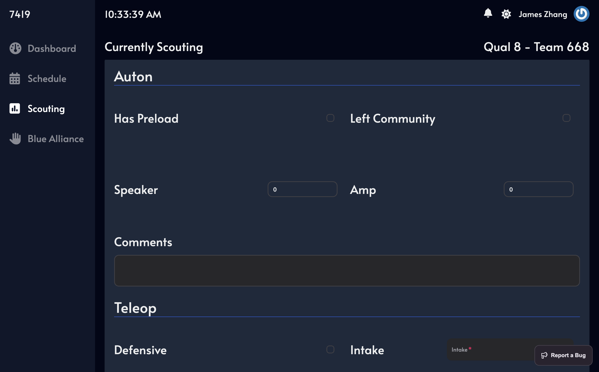
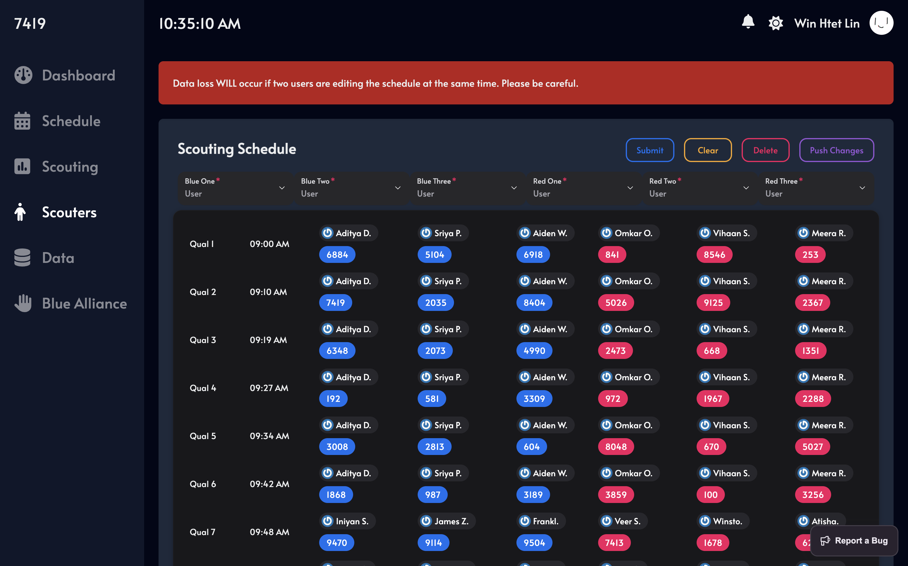
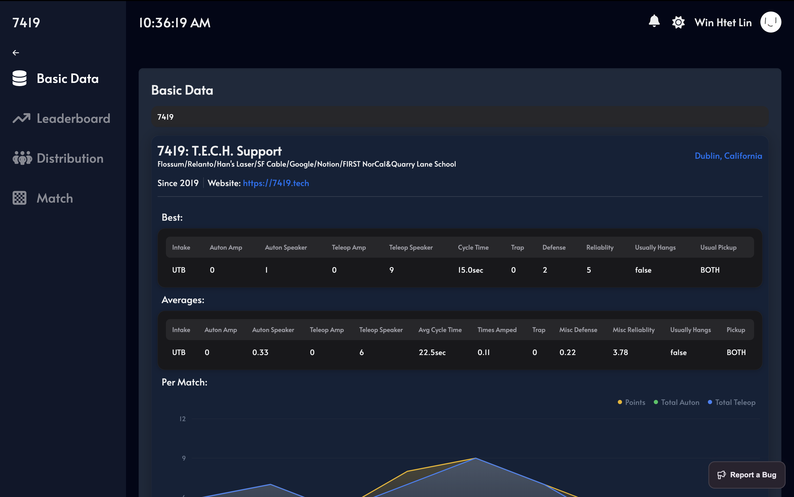
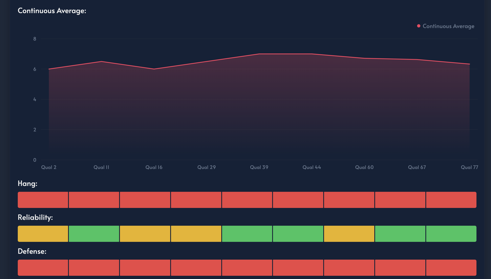
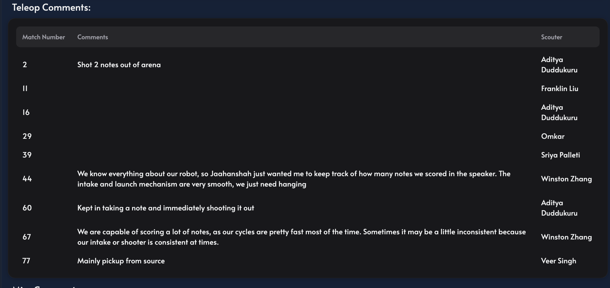
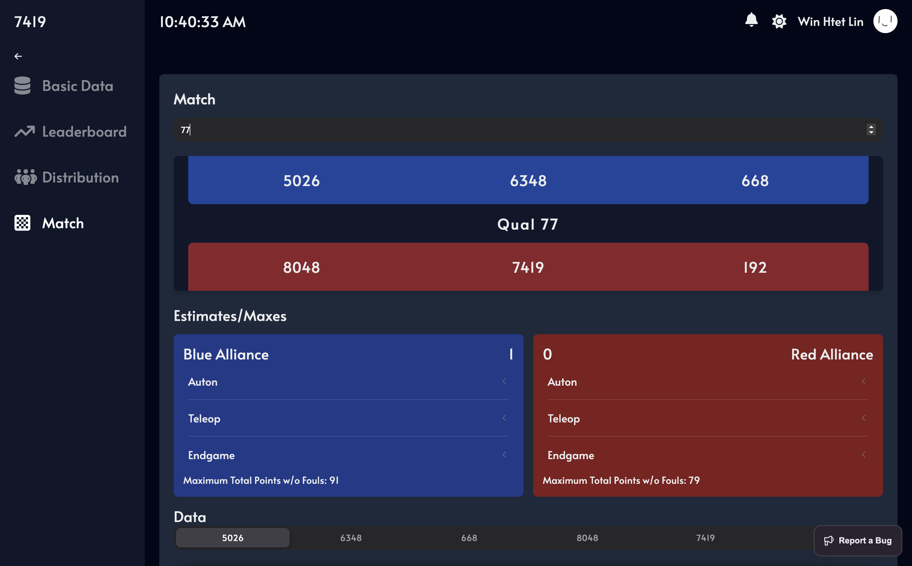
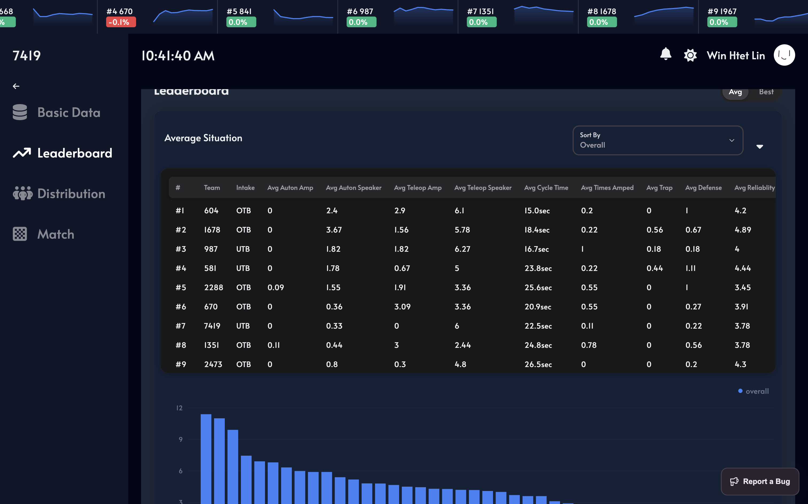

# 🚀 7419 Scouting App 📊

A cutting-edge scouting app designed for the FRC 2024 Crescendo season. 🤖

## Features 🌟

- **Cloud-based**: ☁️ Access your data from anywhere, anytime.
- **Real-time data**: 📈 Get updates on match statistics and team performance.
- **Intuitive Interface**: 🎨 Easy-to-use design for seamless scouting experience.
- **Blue Alliance Integration**: 🤝 Seamlessly integrate data from Blue Alliance for match and scouting schedules as well
  as team information.
- **Scouting Schedule**: 🗓️ Plan your scouting schedule efficiently with a built-in schedule feature.
- **Data Analysis**: 🔍 Dive deep into match data to uncover insights and strategies.
- **Data Visualization**: 📊 Visualize match trends and team performance through dynamic graphs and charts.

## To Do 📝

- Implement alliance selection and match strategy features. 🛡️
- Data across all events and event selection. 📈
- Add offline support for data collection in areas with limited connectivity. 📴
- Develop custom scouting report templates for different scouting strategies. 📋
- Customize scouting forms, data visualization, analysis tools for specific team needs. 🛠️

Currently customizibility is very limited and many things are hard coded. This is an area of improvement we are working on so basically right now it's a proof of concept for a scouting app that can be used by many teams.

## Tech Stack 🛠️

      

## Landing Page

## Scouting Form

## Admin Schedule

## Team Data

## Match Data

## Leaderboard

## Documentation

Coming soon!

## Contributing 🤝

We encourage you to contribute to 7419 Scouting App! Please check out the [contributing guidelines](./CONTRIBUTING.md)
for more details.

## Self-Hosting 🏠

Our self-hosting guide [SELFHOSTING.md](./SELFHOSTING.md) will walk you through the steps required to set up and run our
scouting app on your own infrastructure.

## Thanks

We would like to extend our heartfelt thanks to the following organizations for their support and resources:

## [Sentry.io](https://sentry.io)

Special thanks to [Team 7419](https://7419.tech/) for their invaluable support and resources.

— The 7419 Programming Team
