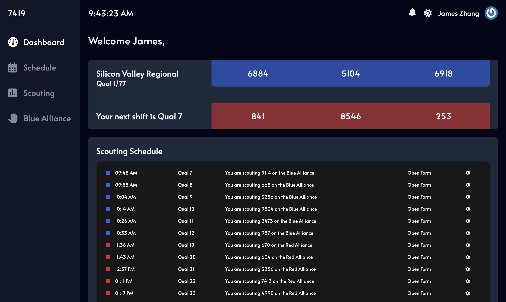
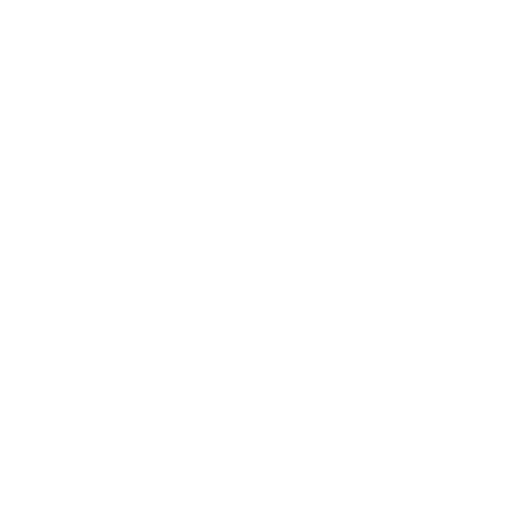

  

      
 

# 7419 Scouting App

A new scouting app for the FRC 2024 Crescendo season.

## Features

- Cloud-based
- Real-time data
- Easy to use
- Blue Alliance integration
- Scouting schedule
- Data analysis
- Data visualization

## Documentation

coming ig

## Thanks

By the 7419 programming team.